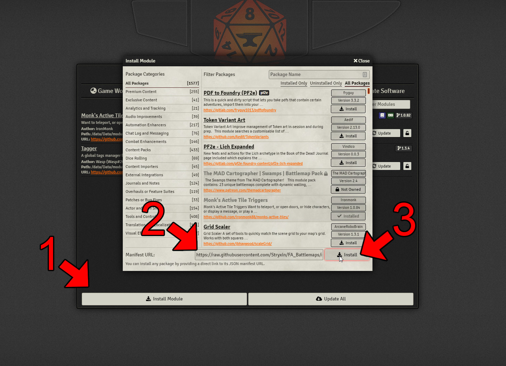
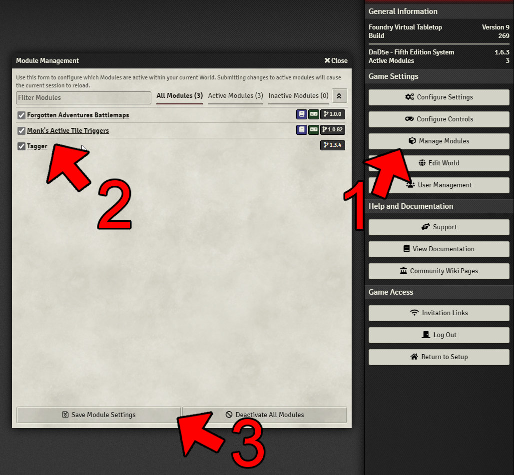
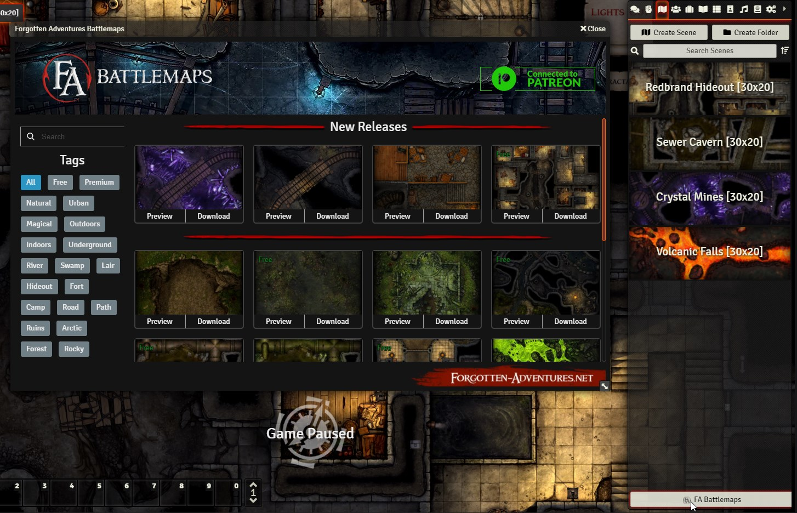
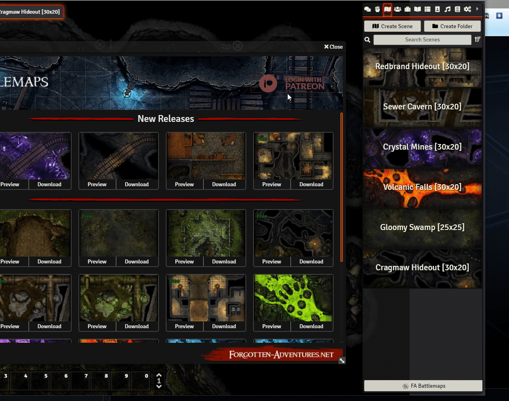
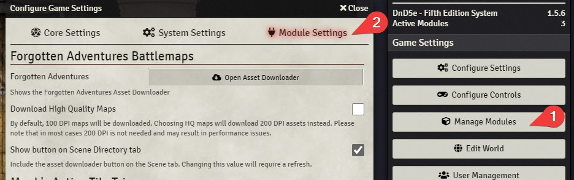

# FA_Battlemaps

This Module contains battlemaps from Forgotten Adventures, fully integrated for use with Foundry VTT. Featuring extra capabilities using [Monk's Active Tile Triggers](https://github.com/ironmonk88/monks-active-tiles/) and [Tagger](https://github.com/fantasycalendar/FoundryVTT-Tagger) for truly dynamic scenes!

## Installation:
1. Copy & paste this link in Foundrys Module Manager to install the Module

    > https://raw.githubusercontent.com/Forgotten-Adventures/FA_Battlemaps/main/module.json
    

2. Enable the Module + the dependency modules (Monk's Active Tile Triggers & Tagger) in your worlds Module Settings

## How to Use

To open the module interface click the "FA Battlemaps" button at the bottom of the Scenes panel. You can also open the interface in the module settings and disable this button if you wish.

### Downloading & Importing Scenes

1. Choose a map you would like to import and click the "Download" button. 

2. Wait until the loading and download of all associated  assets is finished and you see a "[Map name] has been imported successfully." popup.
	
3. Enjoy!

### Patreon Login

1. Open the module interface
2. Click on "Login with Patreon" button to authenticate with patreon (Sucessful authentication turns the button green) which allows you to download Premium ( Patreon only ) maps - You must be a Battlesmith or higher Patreon supporter of [FA_Battlemaps](https://www.patreon.com/FA_Battlemaps). 

* Patreon login has to authenticate through a browser window. Make sure you are logged in on Patreon in your browser before attempting the authentication.
* If you get an Authentication Error in the browser window, just close it and click the button in the module again. Patreon API can be a bit wonky sometimes.
* Free Maps do not require Patreon authentication to be downloaded/imported.

### Module Settings

Module Settings allow you to

1. Open the interface 
2. Disable the "FA Battlemaps" button at the bottom of the scenes panel
3. To activate "Download High Quality Maps"

## Changelog:
_____________
v1.0.29
* Hotfix update
_____________
v1.0.28
* Added new maps
* Module now supports Foundry v11 - We are aware of the release of v11 for Foundry and while maps are downloadable through our module, they will not behave as expected. For now we recommend staying on v10 until we are able to provide proper compatibility.
_____________
v1.0.27
* Added new maps
_____________
v1.0.26
* Hotfix update
_____________
v1.0.25
* Added new maps
* Added animations
_____________
v1.0.24
* Hotfix update
_____________
v1.0.23
* Added new maps
_____________
v1.0.22
* Hotfix update
_____________
v1.0.21
* Added new maps
_____________
v1.0.20
* Added new maps
_____________
v1.0.19
* Hotfix update
_____________
v1.0.18
* Hotfix update
_____________
v1.0.17
* Hotfix update
_____________
v1.0.16
* Hotfix update
_____________
v1.0.15
* Added new maps
_____________
v1.0.14
* Drop support for v9 of Foundry 
* Added new maps
* Fixes for new version of [Monk's Active Tile Triggers]
_____________
v1.0.13
* WEC fix for Foundry v10.287
_____________
v1.0.12
* Added New Maps
* All maps moving forward are created only for Foundry v10 !  Compatibility with older versions is not guaranteed. 
* Due to changes for scene packaging in v10, thumbnails are not part of the scene imports, you'll have to right click and regenerate thumbnail.
_____________
v1.0.11
* Added option to remove the Knight statue from the Forest Glade map (double click on the statue)
_____________
v1.0.10
* Added New Maps
* Fixes to overhead tiles due to changes in the most recent Foundry version
* Some maps changed from 200 grid scale to 100
* Other small fixes
_____________
v1.0.9
* Added New Maps
_____________
v1.0.8
* Bug Fixing
_____________
v1.0.7
* Added new Maps
* Fixed couple of bugs for Foundry v10
_____________
v1.0.6
* Fixed v10 setting validation issue
_____________
v1.0.5
* Added new Maps
_____________
v1.0.4
* Added new Maps
_____________
v1.0.3
* Added new Maps
_____________
v1.0.2
* Small Fixes
_____________
v1.0.1
* Added new Maps
* Fixed issues with new versions of Monk's Tile Triggers and Tagger
_________________
v1.0.0
* Launch!
_________________

## Acknowledgement

Many thanks Blair#9056 for picking up the project and helping us get it through the finish line - amazing work! and also DarkestHour111#2731 for early development  ^_^

Our module utilizes these awesome modules:
* Monks Active Tile Triggers by IronMonk https://github.com/ironmonk88/monks-active-tiles - https://www.patreon.com/ironmonk
* Tagger by Wasp - https://github.com/fantasycalendar/FoundryVTT-Tagger - https://ko-fi.com/fantasycomputerworks

## Support

You can support the creation of our battlemaps on [Patreon!](https://www.patreon.com/FA_Battlemaps)

A gallery of our work can be found on the [website](https://www.forgotten-adventures.net/battlemaps).
	
Join our [Discord server](https://discord.gg/6KSJz6p) for any further questions or bug reports.
